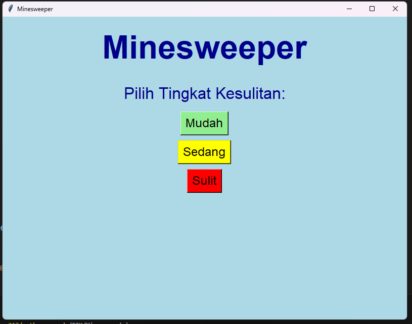

# Game-Infor
Tempat pengumpulan game python informatika
# Nama Game
Minesweep
# SETUP
Testings
1. Klik Opsi "Branch"
2. Klik "New Branch", lalu beri label dengan nama game kalian  
3. Upload Program Kalian di Branch template: Nama1-absen1/Nama2-absen2
4. Edit file README kalian dengan mengisi Judul game (pojok bawah branch, logo pensil)

# Screenshotan

